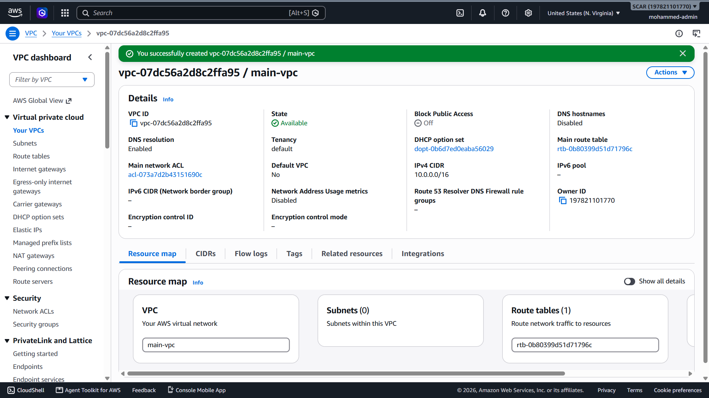
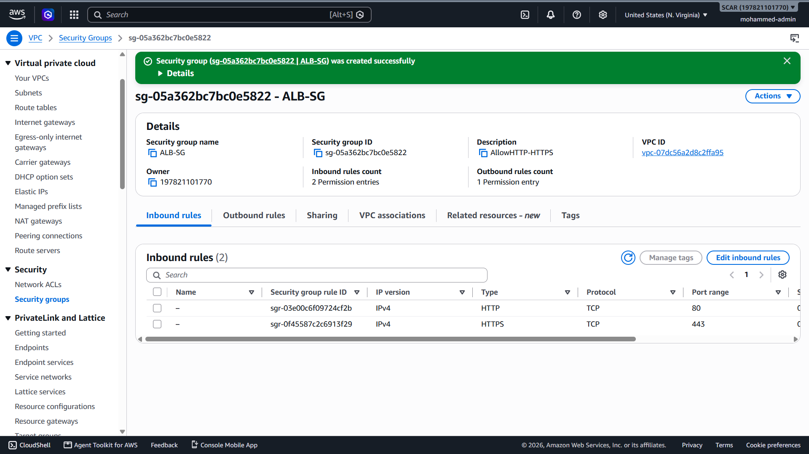
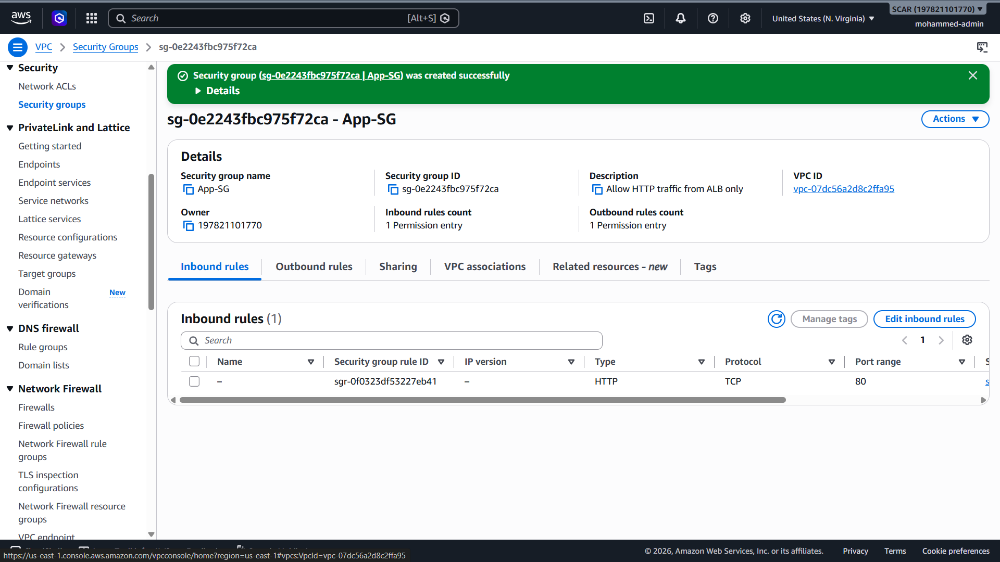
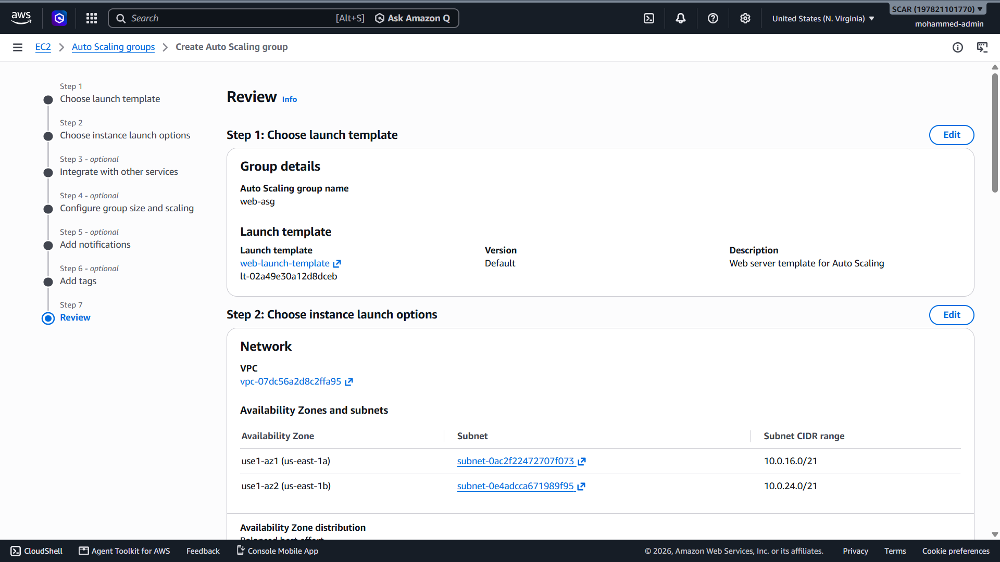
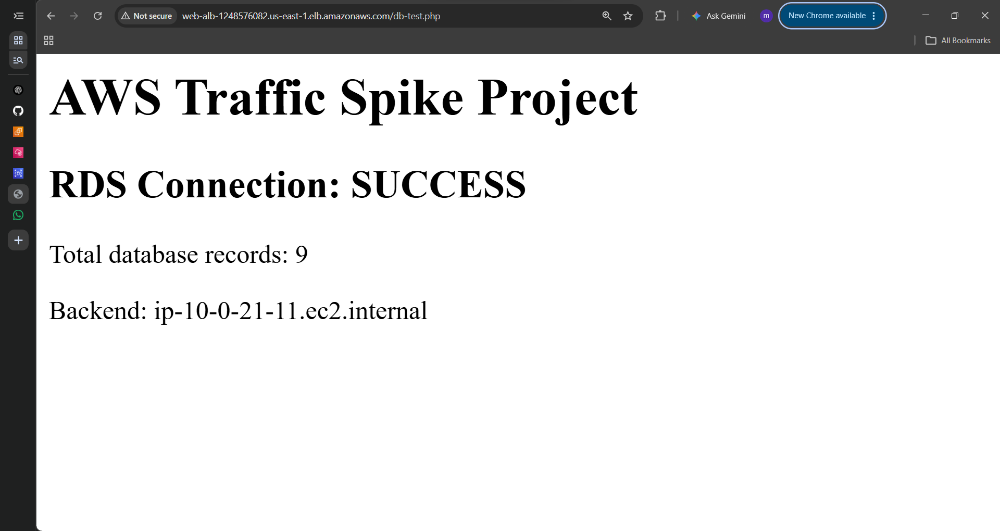
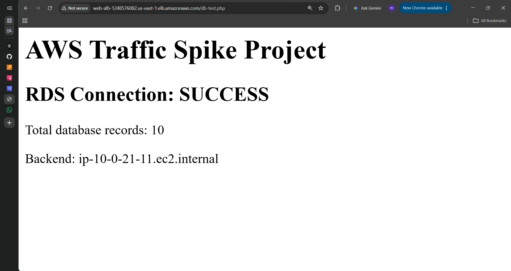
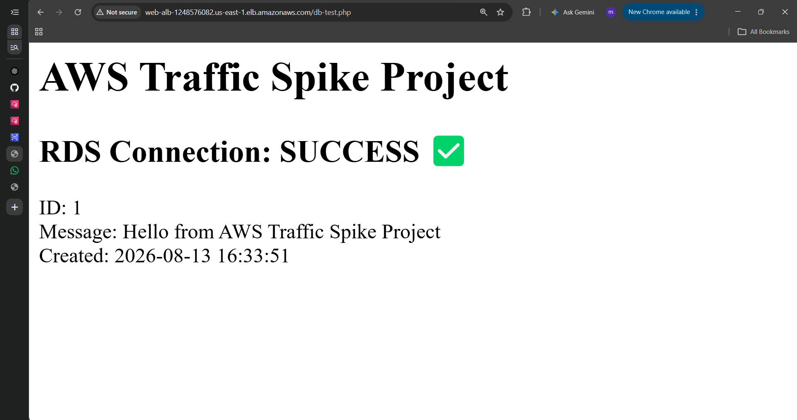
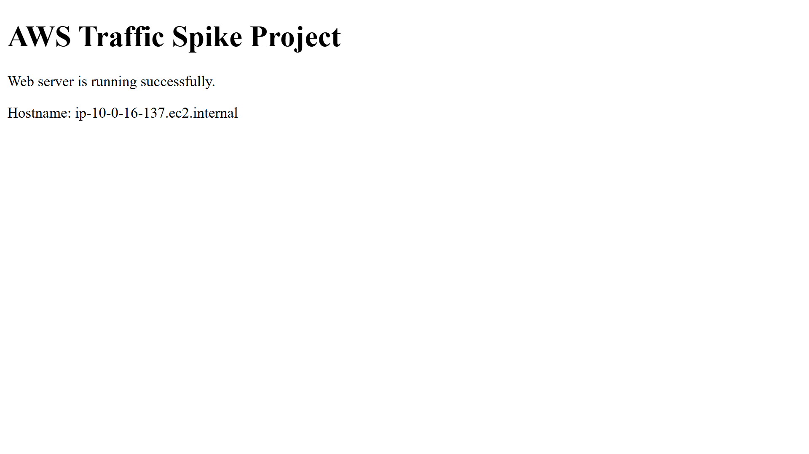
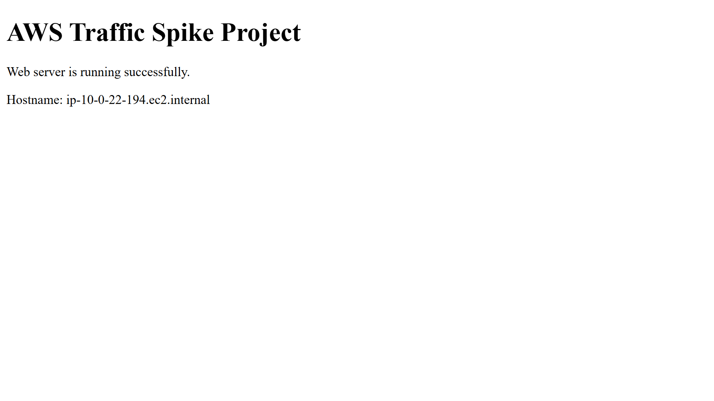

# AWS Traffic Spike Production Architecture

## Project Status

**Completed and verified.**

This project solves a realistic reliability problem: a web application must survive sudden traffic spikes without exposing its application or database tiers directly to the Internet.

## Business Problem

A legacy single-server application suffers from:

- Single point of failure
- No horizontal scaling
- Weak network isolation
- Limited health visibility
- Database exposure risk
- Manual server configuration that does not scale

## Implemented Architecture

```text
Internet
   |
   v
Application Load Balancer
(public subnets)
   |
   v
Target Group
   |
   v
EC2 Auto Scaling Group
(private subnets across two AZs)
   |
   +--> Apache + PHP application
   |
   v
Private RDS MySQL
   |
   v
webapp.visits
```

Supporting services:

```text
NAT Gateway       -> outbound access for private EC2
Systems Manager   -> private EC2 administration
CloudWatch        -> scaling and health monitoring
SNS               -> email notifications
IAM               -> instance permissions
```

## Visual Evidence

The repository keeps the complete screenshot set for implementation evidence. The most useful proof points are surfaced here so the README tells the story without becoming a screenshot dump.

### 1. VPC foundation



The project started with a dedicated VPC and a multi-subnet design across Availability Zones.

### 2. Security-group layering





The public load balancer and private application tier use separate security boundaries rather than exposing EC2 directly to the Internet.

### 3. Auto Scaling configuration



The application tier was managed by an Auto Scaling Group with a baseline of two instances and a maximum of four.

### 4. End-to-end ALB success


This verified the public request path through the ALB into the private application tier.

### 5. Load balancing across multiple backends





Successive requests reached different EC2 hostnames, demonstrating that the ALB was distributing traffic across Auto Scaling-managed backends.

### 6. Shared RDS state across backends


The visit counter remained shared even when the backend hostname changed, proving that application state was persisted in RDS instead of on individual EC2 instances.

### 7. Full ALB-to-RDS application path



This validated the complete application flow from browser traffic through the load-balancing and compute tiers to the private MySQL database.

### 8. Load-balancing hostname change after refresh





The backend hostname changed across refreshes while the application remained available.

> The repository also includes the full screenshot evidence set and the archive `aws-project-screenshots.zip` for deeper review.

## What Was Actually Verified

- Multi-AZ VPC design with public and private subnets
- Internet-facing ALB with private EC2 backends
- Auto Scaling baseline of `2`, maximum of `4`
- Full elasticity cycle: `2 -> 3 -> 4 -> 3 -> 2`
- Systems Manager access to private EC2 instances
- Private RDS MySQL with `DB-SG` allowing TCP/3306 only from `App-SG`
- EC2-to-RDS TCP connectivity and MySQL authentication
- SQL database/table creation plus INSERT and SELECT
- PHP application reading from and writing to RDS
- Repeated ALB requests reaching different EC2 backends while sharing one persistent RDS visit counter
- Configuration drift diagnosed and fixed by moving application bootstrap into the Launch Template
- CloudWatch unhealthy-target alarm with SNS email notification
- Final dashboard verified after rolling instance replacement
- Project resources cleaned up after evidence collection
- Final AWS Bills page showed estimated grand total `USD 0.00` under the Free Plan at cleanup time

## Final Application Path

```text
Browser
   -> ALB
   -> Auto Scaling EC2
   -> Apache/PHP
   -> Private RDS MySQL
```

The dashboard displayed the RDS connection state, total visits, current backend hostname, and last request time. Refreshing the page demonstrated both load balancing and shared database persistence.

## Engineering Lesson: Configuration Drift

During testing, one backend had the new PHP file while another did not. The ALB therefore alternated between a successful response and `404 Not Found` even though both targets were healthy.

The fix was not to keep editing servers manually. The application bootstrap was moved into the Launch Template and the fleet was refreshed so every replacement/scaled instance launched consistently.

## Production Hardening Recommendations

The following are intentionally documented as **recommended, not implemented**:

- **HTTPS + ACM** — terminate TLS on the ALB and redirect HTTP to HTTPS. Not implemented because no owned domain was available for certificate validation.
- **AWS WAF** — add managed and rate-based application-layer protection where justified.
- **Secure database credentials** — replace static passwords in User Data/application files with Secrets Manager and/or IAM Database Authentication, least-privilege IAM, a dedicated application DB user, TLS, and rotation.
- **RDS Multi-AZ** — recommended for production availability; the lab used Single-AZ because the Free Plan restricted deployment options.

## Cost Control and Cleanup

Temporary resources were deleted after final testing, including Auto Scaling capacity, ALB, NAT Gateway, RDS, target group, Launch Template, project security groups, project IAM role, alarms, and SNS topic.

Final checks also confirmed:

- Elastic IP addresses: `0`
- EBS volumes: `0`
- RDS manual snapshots: `0`
- CloudWatch alarms: `0`
- SNS project topics: `0`

## Documentation

- `docs/architecture.md` — implemented architecture and technical reasoning
- `docs/progress.md` — complete implementation/verification checklist and cleanup record
- `docs/runtime-verification.md` — runtime test evidence
- `docs/rds-and-elasticity-verification.md` — RDS and Auto Scaling verification details
- `aws-project-screenshots.zip` — complete screenshot evidence archive

## Key Takeaway

This project was not just a collection of AWS services. It demonstrated the full engineering loop:

```text
Design -> Build -> Secure -> Scale -> Observe -> Debug -> Verify -> Clean Up
```
